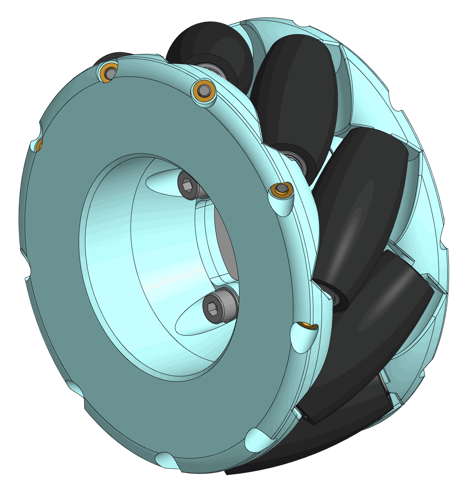

# hw-mecanum-wheel

Samostatné **mecanum kolo** (a budoucí varianty kol) použitelné i mimo R-MODUS.

Součást katalogu: [R-MODUS](https://github.com/R-MODUS) · kontext systému: [doc-thesis](https://github.com/R-MODUS/doc-thesis)

  

## Účel

Všesměrový pohon mobilního podvozku. Sada **4 kol** ve správném zrcadlovém rozložení (L/R) umožňuje holonomní pohyb včetně strafingu.

Toto repo **neobsahuje firmware ani ROS** — jen mechaniku, kusovník a rozhraní (hřídel / svěrka).

## Varianty

| Složka | Stav | Popis |
| --- | --- | --- |
| [`variants/mecanum-100mm`](variants/mecanum-100mm/) | aktivní | Ø 100 mm, 9 válečků, otvor hřídele Ø 6 mm |
| [`variants/_future-classic`](variants/_future-classic/) | plán | klasické / gumové / kompaktní kolo (placeholder) |

Nová varianta = nová podsložka ve `variants/` se stejnou strukturou (`cad/exports`, `assets`, `docs`, `bom.md`).

## Verzování

Verze se **nepíšou do souboru** v repu. Používají se **Git tagy** a GitHub Releases, např. `mecanum-100mm/v1.0.0` nebo `v1.0.0` s poznámkou ve release notes, která varianta platí.

Kompatibilita s referenční sestavou R-MODUS bude v návodu / matrici u softwaru (tag `sw-nav-module` ↔ tag tohoto repa).

## Rychlý start

1. Vyber variantu ve `variants/`.
2. Natiskni / vyrob díly z `cad/exports/` (doplň STEP/STL dle dostupnosti).
3. Sestav podle `docs/` a `bom.md` ve variantě.
4. Dodrž rozhraní v [`docs/interface.md`](docs/interface.md).

## Související

- [hw-robot-platform](https://github.com/R-MODUS/hw-robot-platform) — referenční podvozek
- [hw-esp-4ch-motor-driver](https://github.com/R-MODUS/hw-esp-4ch-motor-driver) — řízení motorů (samostatné repo s FW)

## Licence

[MIT](LICENSE)
