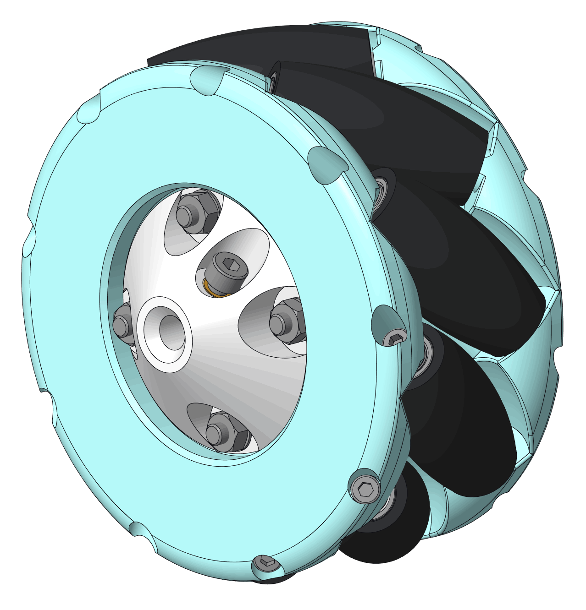
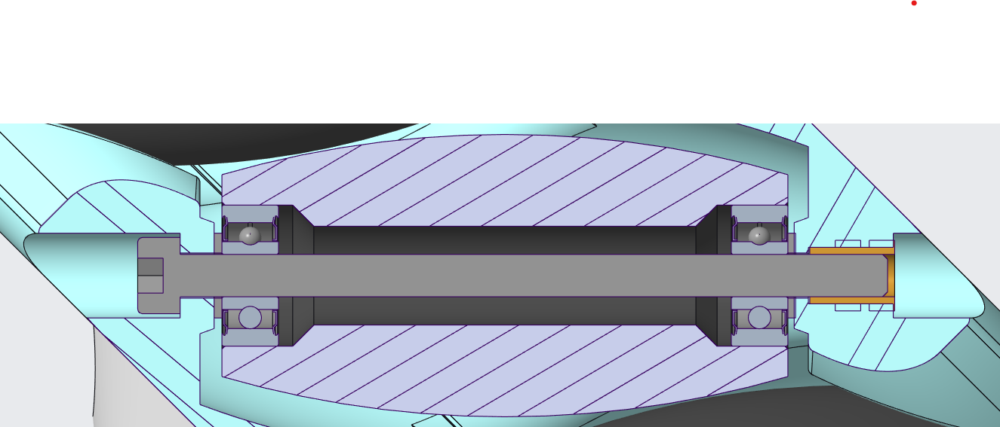

# Varianta: mecanum-100mm

  
  &nbsp;
  

## Parametry

| Parametr | Hodnota |
| --- | --- |
| Průměr kola | 100 mm |
| Šířka kola | 46 mm |
| Šířka s průchodkou motoru | 56 mm |
| Počet válečků | 9 |
| Otvor hřídele | Ø 6 mm |
| Hmotnost | ~0,33 kg |
| Materiál dílů | PLA (3D tisk) |
| Povrch válečků | polyolefin |
| Ložiska | 623 |

## Kusovník (jedno kolo)

Pro podvozek typicky 4× (2× standard + 2× mirrored).

| Položka | Množství | Poznámka |
| --- | --- | --- |
| Vnější prstenec | 1 | `mecanum-outer-ring.stp` |
| Vnitřní prstenec | 1 | `mecanum-inner-ring.stp` |
| Rozhraní hřídele | 1 | `mecanum-shaft-interface.stp` |
| Váleček | 9 | `mecanum-cylinder.stp` |
| Ložisko 623 | 18 | 2× na váleček |
| Smršťovací bužírka Ø20 mm | 40 cm | elektrikářská |
| Šroub M4×14 DIN 912 | 4 | — |
| Šroub M4×10 DIN 912 | 1 | — |
| Šroub M3×50 DIN 912 | 9 | — |
| Matice M4 DIN 934 | 4 | šestihranná |
| Podložka 4 DIN 125 A | 4 | — |
| Podložka 3 DIN 125 A | 18 | — |
| Heat insert M4 | 1 | mosaz, Ø6,3 × L 6 mm |
| Heat insert M3 | 9 | mosaz, Ø4,6 × L 5 mm |

## Montáž

1. Očisti pořádně všechny tištěné díly.
2. Nastříhej bužírku na kousky 4 cm, navlékně je na válečky a horkovzdušnou pistolí je smršti (stačí jen lehce nahřát, ať se váleček nedeformuje).
3. Ve svěráku zalisuj do každého válečku dvě ložiska — každé z jedné strany.

  

4. Do vnějšího kroužku natav M3 heat inserty.
5. Natav heat insert M4 do rozhraní pro upevnění na hřídel.
6. Slož k sobě rozhraní a oba kroužky; lehce je stáhni čtyřmi šrouby M4x14 a maticemi. Pod matice dej podložky. Hlavy šroubů orientuj na vnější kroužek.
7. Postupně vkládej válečky a upevni je šrouby M3x50; na každou stranu k ložisku dej podložku a utahuj s citem.
8. Dotáhni pořádně čtyři šrouby M4, aby se kroužky pevně zafixovaly.
9. Doladění: každý šroub M3 utáhni tak, aby se váleček volně otáčel, ale neměl axiální vůli.

### Připevnění na motor

1. Nasuň kolo na hřídel motoru Ø 6 mm
2. Zafixuj kolo šroubem M4×10.
